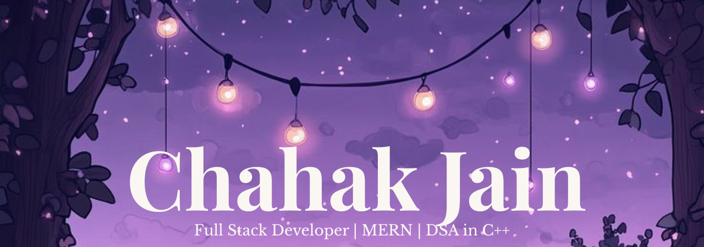

  
 

 

  

  

  

  

 

  I am a Computer Science undergraduate with hands-on experience in building scalable
  full-stack web applications. I enjoy working on secure systems, REST APIs, and CI/CD
  pipelines, and I’m deeply interested in system design, real-world product development,
  and problem-solving.

  

---

  

### 💻 Core Development

  

### 🌐 Full Stack (MERN)

  

### 🗄️ Databases & Cloud

  

### ⚙️ Tools & Workflow

 

 

 

  

  

  

  

